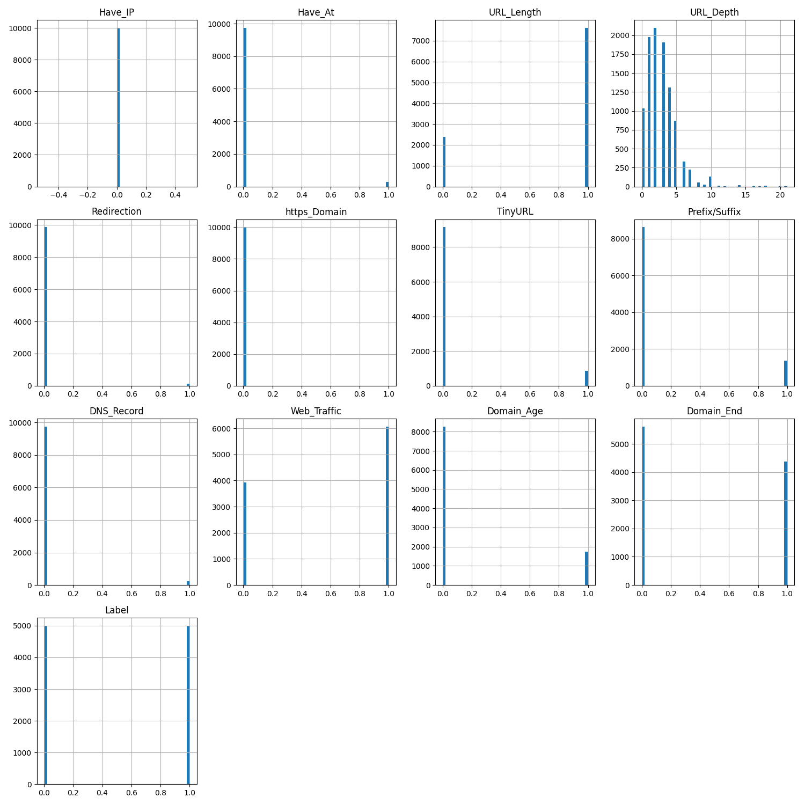

# Data Sets

## Raw Data

> Phishing URLs

[http://data.phishtank.com/data/online-valid.csv]()

> Benign URLs

[https://www.unb.ca/cic/datasets/url-2016.html]()
> Top 1M URLs

[http://s3.amazonaws.com/alexa-static/top-1m.csv.zip]()

## Processed Data

#### Version 2021-2-13

- 13 extracted features
- 5000 legitimate urls
- 5000 phishing urls

